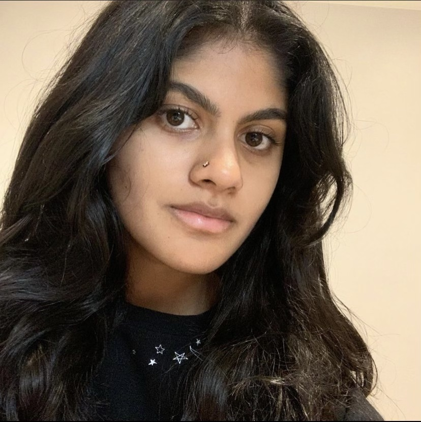

# about me:
**My name is Harsheta Cavale**
*This is what I look like:*  



Some facts about me: 
- I go to UCSD.
UCSD's motto is: 
> let there be light
- I like to bake
Click [here](#favorite-recipes) to learn about my favorite things to bake. 
- I really like loops. Here are my favoites: 

```
for loop
while loop
do while loop

```
- I love dogs.

One of my favorite food blogs for [Baking ](https://sallysbakingaddiction.com/).

## favorite things to bake:
1. apple cider donuts 
2. strawberry shortcake
3. lemon bars

This is one of the dishes I made:


I would love to bake:
[] lemon poppyseed muffins 
[] pumpkin cookies
[] sourdough bread